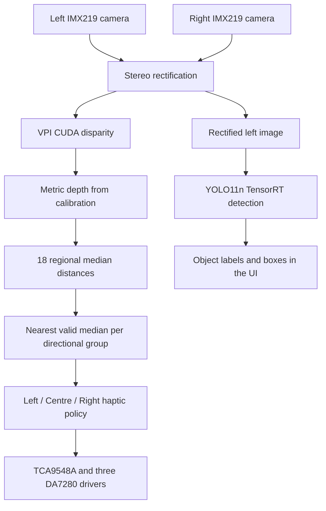

# Distance-to-Haptic Navigation System — FYP2

A final-year project exploring how binocular camera depth can be converted into directional vibration feedback. The current application combines two IMX219 cameras, NVIDIA VPI CUDA stereo processing, indoor object detection, and three haptic outputs on an NVIDIA Jetson Orin Nano.

The repository records the development workflow: stereo calibration, depth tuning, region-based distance experiments, RealSense comparison prototypes, YOLO training, and the combined application.

**Start with [`7.0_distance_to_haptic_system`](7.0_distance_to_haptic_system/README.md) for the combined system.** Use [`4.0_imx219`](4.0_imx219/README.md) for the stereo-depth and haptic application without object detection.

> **Project status:** This is a research prototype. The depth-test documentation reports sparse false-near surfaces in the current stereo results. Validate calibration, distance measurements, and directional mapping on the actual hardware before enabling haptics. Model evaluation scores describe dataset performance, not live navigation reliability.

## Contents

- [Features](#features)
- [How it works](#how-it-works)
- [Hardware and software](#hardware-and-software)
- [Repository guide](#repository-guide)
- [Setup and calibration](#setup-and-calibration)
- [Run the combined application](#run-the-combined-application)
- [Haptic feedback](#haptic-feedback)
- [Object detection and model results](#object-detection-and-model-results)
- [Verification](#verification)
- [Troubleshooting](#troubleshooting)
- [Limitations](#limitations)
- [License](#license)

## Features

- Binocular IMX219 capture configured for **1280 × 720 at 30 FPS**, using CSI sensor IDs 0 and 1.
- Stereo rectification and metric depth from saved camera calibration.
- NVIDIA VPI CUDA stereo with a calibration-specific tuning profile and maximum disparity of 256 pixels.
- **18 independent depth regions**, reduced to **Left, Centre, and Right** distance readings.
- Three DA7280 haptic drivers routed through a TCA9548A I²C multiplexer.
- Fixed-strength vibration with distance-dependent pulse timing.
- YOLO11n indoor object detection through a direct TensorRT runtime, with detection overlays in the interface.
- A PySide6 interface with a camera view, depth heatmap, distance cards, diagnostics, logs, and haptic controls.
- Calibration evidence, depth evaluation tools, and hardware-free unit tests.

The 30 FPS setting is the requested camera capture rate. Actual depth-processing and detection rates are separate and depend on the runtime environment.

## How it works



### From 18 regions to three directions

The depth grid has six columns and three rows. It spans the full image width and the middle 80% of image height; the top and bottom 10% are excluded.

```text
Upper:   U1  U2  |  U3  U4  |  U5  U6
Middle:  M1  M2  |  M3  M4  |  M5  M6
Lower:   L1  L2  |  L3  L4  |  L5  L6
            |         |         |
           Left     Centre     Right
```

One disparity calculation produces the shared depth map. Each cell reports its median valid depth only when it has at least **100 valid pixels** and **1.6% valid coverage**. Otherwise, its distance is unavailable.

Each directional group contains six cells. The application selects the **nearest valid cell median** within that group. These three values feed both the distance cards and the haptic policy. The result is a minimum of regional medians, rather than a minimum over individual pixels.

**Object detections provide visual context only.** Haptic commands come from stereo distances. Detection failure removes the overlays while allowing stereo depth and haptics to continue.

## Hardware and software

### Hardware

| Component | Purpose / default configuration |
|---|---|
| NVIDIA Jetson Orin Nano | Camera capture, stereo processing, detection, and UI |
| Two IMX219 CSI cameras | Binocular depth; left sensor ID 0, right sensor ID 1 |
| TCA9548A I²C multiplexer | Bus 1, address `0x70` |
| Three DA7280 drivers and LRA actuators | Driver address `0x4A` behind separate multiplexer channels |
| Checkerboard | Stereo calibration; default 9 × 6 inner corners and 25 mm squares |
| Intel RealSense D435i, optional | Independent depth-comparison experiments in `3.x` and `5.0` |

The haptic channel mapping is **Left → SC2**, **Centre → SC3**, and **Right → SC4**. See [`config.py`](7.0_distance_to_haptic_system/config.py) for the application and I²C defaults. Verify physical wiring and actuator configuration against your hardware.

### Software

The combined application targets the Jetson Linux/JetPack environment. Its launchers use `/usr/bin/python3`.

| Dependency | Used for |
|---|---|
| Python 3 | Applications and diagnostic tools |
| JetPack/Ubuntu OpenCV and compatible NumPy | GStreamer camera capture, rectification, and image processing |
| GStreamer with `nvarguscamerasrc` | Jetson CSI camera pipelines |
| NVIDIA VPI Python bindings | CUDA stereo processing |
| PySide6 | Desktop interface |
| `smbus2` | I²C actuator control; imported even when haptics are disabled |
| TensorRT and `cuda-python` with `cuda.bindings.driver` | Direct YOLO inference in the combined application |
| `pyrealsense2`, optional | RealSense experiments |
| Open3D, optional | Snapshot point-cloud inspection in diagnostic tools |
| Ultralytics and a compatible CUDA PyTorch build, optional | YOLO training and engine export |

Use dependency versions compatible with your installed JetPack environment. The repository does not currently provide a root dependency manifest or a complete environment installer. The recorded deployment engine was built with **TensorRT 10.3.0**.

The stereo pipeline expects GStreamer-enabled OpenCV. A pip OpenCV wheel can shadow the JetPack/Ubuntu build and prevent CSI capture. The current `7.0` detection runtime uses TensorRT directly and does not import Ultralytics or PyTorch.

## Repository guide

| Folder | Role |
|---|---|
| [`1.0_calibration`](1.0_calibration/README.md) | Capture, filter, solve, and inspect stereo calibration |
| [`1.1_depth_visualization`](1.1_depth_visualization/README.md) | Live/offline depth inspection and automatic VPI tuning |
| [`2.0_testdepthimx219`](2.0_testdepthimx219/README.md) | Tuned IMX219 depth evaluation and diagnostic exports |
| [`2.1_testdepthimx3frame`](2.1_testdepthimx3frame/README.md) | Three separate central measurement boxes |
| [`2.2_testdepthimx3zone`](2.2_testdepthimx3zone/README.md) | Three contiguous vertical measurement regions |
| [`2.3_testdepthimx6zone`](2.3_testdepthimx6zone/README.md) | Six regions arranged as a 3 × 2 grid |
| [`2.4_testdepthimx9zone`](2.4_testdepthimx9zone/README.md) | Nine regions arranged as a 3 × 3 grid |
| [`2.5_testdepthimx18zone`](2.5_testdepthimx18zone/README.md) | Eighteen regions arranged as a 6 × 3 grid |
| [`3.0_testdepthrealsensed435i`](3.0_testdepthrealsensed435i/README.md) | RealSense centre-depth comparison |
| [`3.1_testdepthrealsense3frame`](3.1_testdepthrealsense3frame/README.md) | RealSense three-box median-depth evaluation |
| [`4.0_imx219`](4.0_imx219/README.md) | IMX219 depth and three directional haptic outputs |
| [`5.0_realsense`](5.0_realsense/README.md) | RealSense depth, detection, and haptic prototype |
| [`6.0_yolomodel`](6.0_yolomodel/README.md) | Baseline YOLO artifacts and training notebooks |
| [`6.1_yolo11n_indoor_v2_results`](6.1_yolo11n_indoor_v2_results/README.md) | Current indoor-v2 checkpoint, exports, and evaluation evidence |
| [`7.0_distance_to_haptic_system`](7.0_distance_to_haptic_system/README.md) | Combined IMX219 depth, indoor-v2 detection, and haptic application |

Root-level scripts, `old*`/`copy*` folders, and the C++ calibration example preserve earlier experiments and reference implementations. Follow the numbered stages above for the current workflow.

## Setup and calibration

Run these commands in a terminal on the target Jetson. Examples assume that the software dependencies are already available.

### 1. Obtain the repository

```bash
git clone https://github.com/yucodings/distancetohapticfyp2.git
cd distancetohapticfyp2
```

Repository access requires an authorized GitHub account while the repository is private. Keep the folder layout intact: the launchers locate calibration and tuning files through relative paths.

### 2. Calibrate the stereo pair

```bash
cd 1.0_calibration
/usr/bin/python3 mycalibration.py
```

The defaults are a **9 × 6 inner-corner checkerboard** with **25 mm squares**. Update `CHECKERBOARD` and `SQUARE_SIZE_M` in [`mycalibration.py`](1.0_calibration/mycalibration.py) if your physical board differs; the square size determines the metric scale.

1. Show the complete board to both cameras.
2. Press **Space** to save a stereo pair.
3. Capture at least **20 sharp pairs**, varying board distance, angle, and position across the image.
4. Press **Q** to calibrate.

Each timestamped session under `images/` contains raw pairs, corner-detection evidence, rejection evidence, rectified validation images, a JSON quality report, and a completed `stereo_calibration.npz` when calibration succeeds.

Review the report and rectified checkerboards. Corresponding corners should follow the same horizontal guides. Automatic filtering rejects unreliable pairs and stops without producing an NPZ if fewer than 20 accepted pairs remain.

To recalibrate the newest existing image session without capturing again:

```bash
/usr/bin/python3 recalibrate_existing.py
```

This creates a new session and preserves the original images and calibration. See the [calibration guide](1.0_calibration/README.md) for selecting a specific session and interpreting the quality checks.

### 3. Tune the depth profile

From `1.0_calibration`:

```bash
cd ../1.1_depth_visualization
bash run_easy_tuner.sh
```

Place a textured target exactly **1.0 m** from the cameras, clear closer objects from all three image columns, and keep the scene still. Press **A** once to evaluate five live stereo pairs, then **Q** to finish.

The tuner saves the recommended schema-2 profile to:

```text
1.1_depth_visualization/results/vpi_recommended_profile.json
```

The profile includes the calibration's SHA-256. VPI startup rejects a calibration/profile mismatch. **Rerun Easy Mode after changing or recalibrating the camera pair.** The application launchers select the newest completed calibration by file modification time.

### 4. Check depth before enabling haptics

```bash
cd ../2.5_testdepthimx18zone
bash run_with_latest_calibration.sh
```

Inspect the 18 regions and compare measurements with textured targets at 0.5, 1.0, 1.5, 2.0, and 3.0 m. Use **D** for disparity diagnostics, **S** to save evidence, and **Q** or **Esc** to exit. Investigate unstable readings, false-near surfaces, low valid coverage, or excessive pair skew before using the haptic application.

## Run the combined application

From the repository root:

```bash
cd 7.0_distance_to_haptic_system
```

First, check that the main runtime dependencies and GStreamer-enabled OpenCV can load:

```bash
/usr/bin/python3 -c "import stereo_core; stereo_core.check_gstreamer(); import vpi, tensorrt, PySide6, smbus2; from cuda.bindings import driver; print('Runtime imports and OpenCV GStreamer check passed')"
```

This checks software availability; it does not open cameras or test actuators.

### Cameras, depth, and detection

```bash
bash run_with_latest_calibration.sh
```

The launcher supplies the newest completed calibration and recommended VPI profile. Click **Start** in the application to begin streaming. Leave haptics disabled while checking camera orientation, distances, depth coverage, and detector status.

### Complete system with physical haptics

```bash
bash run_with_sudo.sh
```

This launcher obtains the I²C privileges needed for actuator access and preserves the desktop Python package path. Haptics still start disabled. After starting the stream and validating the directional mapping, click **Enable Haptics**.

Use **Disable Haptics** to turn off feedback while streaming, **Stop** to stop the pipeline, or **EMERGENCY STOP** to request all motors off. Stale depth beyond the configured 1.0-second threshold, worker errors, and application shutdown also request the motors off.

### Useful options

```bash
# Run stereo depth without loading the detector
bash run_with_latest_calibration.sh --no-detection

# Reduce the maximum detection submission rate
bash run_with_latest_calibration.sh --detection-fps 1

# Select another compatible TensorRT engine
bash run_with_latest_calibration.sh --model /path/to/model.engine

# Inspect all application options
/usr/bin/python3 app.py --help
```

Other options include `--calibration`, `--vpi-profile`, `--backend`, `--left-id`, `--right-id`, `--max-depth`, `--detection-confidence`, `--detection-iou`, and `--detection-max-results`. Use `--backend opencv` for CPU StereoSGBM comparison; VPI CUDA is the default.

## Haptic feedback

Each direction is evaluated independently. All active patterns use a fixed drive level of **25/127**; distance changes the pulse timing.

| Directional distance | Feedback | On / off duration |
|---|---|---|
| Unavailable or greater than 2.0 m | Off | — |
| 1.5 m to 2.0 m, inclusive | Slow pulse | 0.50 s / 1.00 s |
| 0.5 m to less than 1.5 m | Fast pulse | 0.20 s / 0.20 s |
| Less than 0.5 m | Urgent pulse | 0.10 s / 0.10 s |

For example, a valid left reading of 0.8 m triggers the left fast pattern. Centre and right follow their own readings. An unavailable reading switches that direction off; it does not establish that the space is clear.

The DA7280 generates the LRA carrier. The Python actuator controller controls the vibration envelope and timing. See [`haptic_policy.py`](7.0_distance_to_haptic_system/haptic_policy.py) and [`actuators.py`](7.0_distance_to_haptic_system/actuators.py) for the implementation.

## Object detection and model results

The active `7.0` model is:

```text
7.0_distance_to_haptic_system/models/best_indoor_v2.engine
```

It comes from the checkpoint and export workflow in [`6.1_yolo11n_indoor_v2_results`](6.1_yolo11n_indoor_v2_results/README.md). The model uses **27 classes**, including people, chairs, handrails, stairs, ramps, pillars, cleaning carts, wet-floor signs, and other indoor objects.

Runtime defaults are **640 × 640 input**, **static batch 1**, **FP16**, **2 detection submissions per second**, confidence **0.40**, and IoU **0.50**. The application performs postprocessing and class-aware non-maximum suppression itself; the engine must have embedded NMS disabled.

Detection uses the rectified left frame, a newest-frame mailbox, and shared GPU scheduling that gives depth processing priority. Temporal matching and smoothing stabilize the displayed boxes. Detection results never feed the haptic distance calculation.

### Recorded evaluation

The repository's [evaluation summary](6.1_yolo11n_indoor_v2_results/yolo11n_indoor_v2/fyp2_evaluation_summary.json) reports:

| Evaluation split | Precision | Recall | mAP50 | mAP50–95 |
|---|---:|---:|---:|---:|
| Merged validation | 0.565 | 0.507 | 0.503 | 0.329 |
| Custom-only test | 0.879 | 0.807 | 0.877 | 0.624 |

These measurements apply to their respective dataset splits. Live results can differ with lighting, viewpoint, motion blur, occlusion, and unfamiliar rooms.

### Rebuild the engine for another environment

TensorRT engines depend on the target device and TensorRT environment. Rebuild on the Jetson that will execute the model when those differ from the recorded deployment. Stop the camera/depth applications before exporting.

From the repository root, with the compatible training/export dependencies installed:

```bash
cd 6.1_yolo11n_indoor_v2_results
/usr/bin/python3 export_best_indoor_v2_to_engine.py --force
```

`--force` replaces an existing engine with the same name. The exporter checks the engine structure and performs a blank-frame inference through the `7.0` detector backend.

Run the newly exported engine explicitly from the application folder:

```bash
cd ../7.0_distance_to_haptic_system
bash run_with_latest_calibration.sh \
  --model ../6.1_yolo11n_indoor_v2_results/best_indoor_v2.engine
```

The original `best.engine` artifacts remain available for earlier experiments and rollback. The RealSense `5.0` prototype uses the earlier model by default.

## Verification

### Unit tests

From `7.0_distance_to_haptic_system`, in an environment with the required software dependencies:

```bash
/usr/bin/python3 -m unittest discover -s tests -v
```

The tests cover actuator behavior with mock I²C transports, haptic thresholds, stereo-region reduction, detection processing, overlay stability, and UI components. They do not activate physical motors. Calibration, tuner, depth-test, and other application folders contain their own test suites; run the same discovery command from the relevant folder.

### Combined camera/GPU smoke test

With both IMX219 cameras connected and a matching calibration, profile, and engine available:

```bash
/usr/bin/python3 smoke_test_combined.py
```

This processes a real stereo pair through TensorRT and VPI without initializing haptics. Close other camera applications first.

### Runtime monitoring

```bash
sudo tegrastats --interval 1000
```

Monitor the interface's camera FPS, pair skew, dropped frames, depth FPS, valid-depth coverage, detector status, and haptic status alongside Jetson memory and GPU usage.

## Troubleshooting

| Symptom | What to check |
|---|---|
| No completed calibration found | Complete `1.0_calibration/mycalibration.py` and confirm a session contains `stereo_calibration.npz`. |
| VPI profile missing or calibration hash mismatch | Rerun `1.1_depth_visualization/run_easy_tuner.sh` with the selected calibration. |
| GStreamer is not enabled | Use the JetPack/Ubuntu OpenCV build; check whether a pip installation is shadowing it. |
| An IMX219 camera cannot open | Check CSI connections, distinct sensor IDs, camera configuration, and whether another process has the camera open. |
| Calibration or frame dimensions do not match | Use calibration captured for the application's 1280 × 720, 30 FPS, sensor-mode-4 configuration. |
| Distances are unstable or regions show `N/A` | Inspect calibration evidence, target texture, lighting, rectification, pair skew, and valid-depth coverage. |
| TensorRT engine cannot load | Check the model path, device/runtime compatibility, and required batch-1 FP16 640 × 640 format with NMS disabled. |
| Detection is unavailable | Inspect detector logs; use `--no-detection` to evaluate the stereo pipeline independently. |
| Haptic initialization fails | Use the privileged launcher and check bus 1, multiplexer `0x70`, driver `0x4A`, and channels SC2/SC3/SC4. |
| CUDA allocation fails | Close memory-heavy applications and concurrent camera/depth tools. Monitor shared RAM/GPU memory and reduce the detection rate. |

The [combined application guide](7.0_distance_to_haptic_system/README.md) recommends keeping roughly 700 MB–1 GB of memory available during use. Required memory can vary with the environment and other workloads.

## Limitations

- Stereo depth depends on calibration quality, texture, lighting, and camera geometry. Low-texture, reflective, or occluded surfaces can produce missing or incorrect readings.
- Frame pairing uses host arrival times. It reduces software skew but does not provide hardware-triggered exposure synchronization.
- The grid excludes the top and bottom 10% of the frame. Regional medians can also miss small obstacles occupying only a small part of a cell.
- The default accepted stereo-depth range is 0.20–5.0 m. The haptic policy activates only for valid readings at or below 2.0 m.
- Missing or stale depth turns feedback off, so absence of vibration cannot establish absence of an obstacle.
- Point-cloud diagnostics reconstruct geometry from the same disparity; they do not independently improve the depth estimate.
- The recorded model metrics and export checks do not establish end-to-end navigation performance. Validate the combined system under representative conditions.

## License

No repository-wide license file is currently included. Add an appropriate license before distributing or reusing the project under defined terms, and review the licenses of dependencies, model assets, datasets, and reference code separately.
